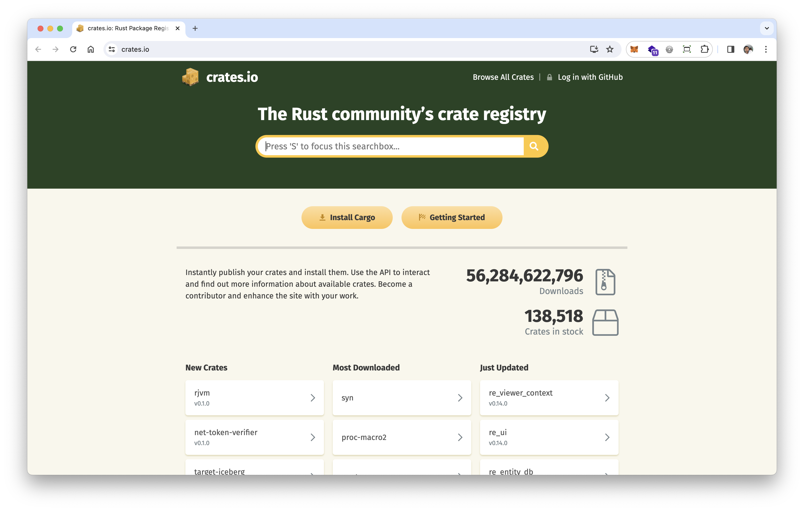
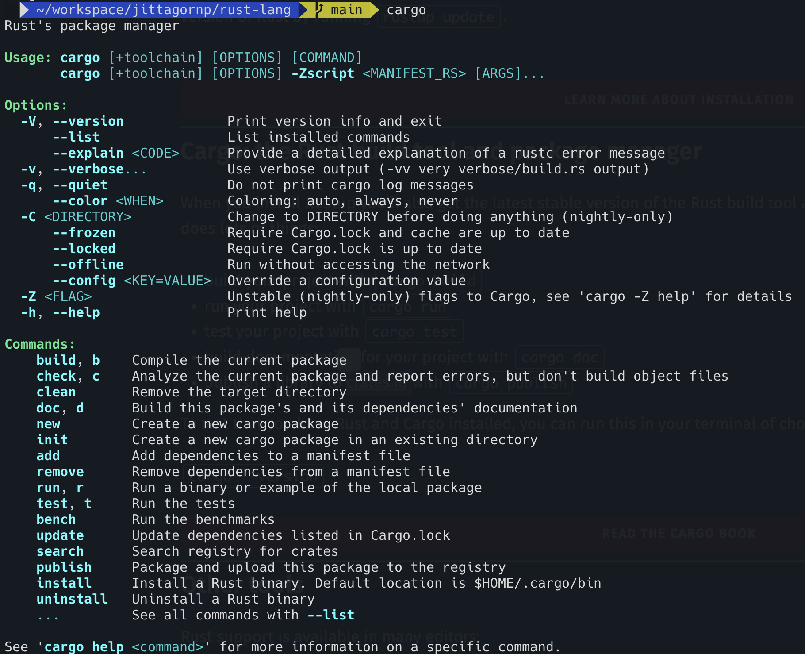
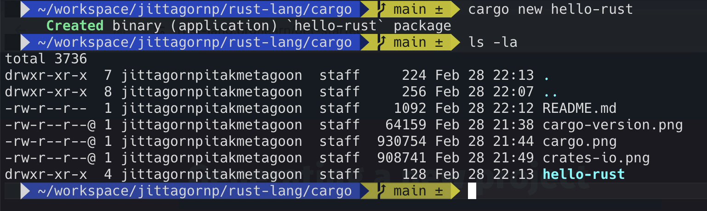
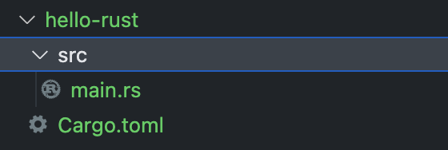
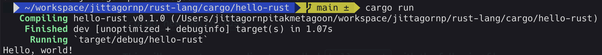
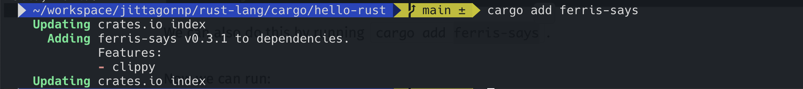
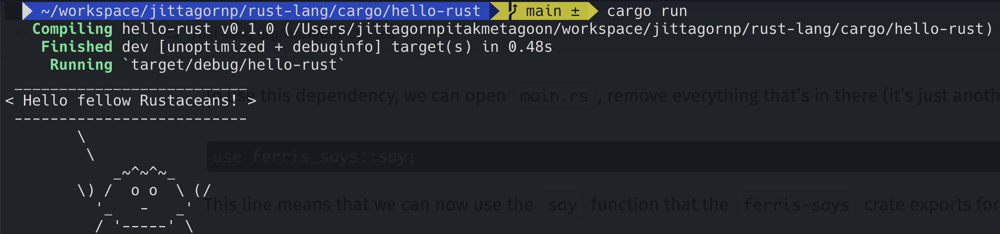

# Cargo

> Cargo เป็น Build tool และ Package Manger ของ Rust จะคล้าย ๆ กับ NPM ของ Node หรือ Maven ของ Java

Check version

```sh
cargo --version
```


คำสั่งต่าง ๆ ของ Cargo

- `cargo new` สำหรับสร้าง Rust Project
- `cargo clean` สำหรับลบ/ล้าง Folder target
- `cargo build` สำหรับ Build/Compile Rust Project
- `cargo run` สำหรับ Run Rust Project
- `cargo test` สำหรับ Test Rust Project
- `cargo add` สำหรับ Add dependencies ต่าง ๆ เข้าไปใน Rust Project
- `cargo doc` สำหรับสร้าง Project Document 
- `cargo publish` สำหรับ Publish Library ไปไว้ที่เว็บ [crates.io](https://crates.io)



อื่น ๆ ดูเพิ่มเติมได้โดยการพิมคำสั่ง `cargo`



# ตัวอย่างการใช้งาน Cargo

```sh
cargo new hello-rust
```



จะเป็นการสร้าง Rust Project ที่ชื่อว่า `hello-rust` ขึ้นมา ซึ่งด้านในจะมีไฟล์ตั้งต้นให้ดังต่อไปนี้



- `Cargo.toml` เป็น Manifest file ของ Project จะคล้าย ๆ กับ file package.json ของ Node หรือ pom.xml ของ Maven ไว้เก็บข้อมูล Meta Data และ Dependencies ต่าง ๆ ของ Project 
- `/src/main.rs` เป็นไฟล์ Main ของ Project ซึ่งด้านในจะมี function `main()` เวลาที่ทำการ Run Application จะ Call มาที่ Function นี้เป็น Function แรก

/src/main.rs

```rust
fn main() {
    println!("Hello, world!");
}
```

ลอง Run Project ด้วยคำสั่ง
```sh
cargo run
```



# การเพิ่ม Dependency เข้าไปใน Project

Run command

```sh
cargo add <dependency>
```

ตัวอย่าง

```sh
cargo add ferris-says
```



เมื่อเราไปเปิดไฟล์ `Cargo.toml` เราจะเห็นว่าตรง Dependencies มีการเพิ่ม `ferris-says = "0.3.1"` เข้าไป

/Cargo.toml
```
[package]
name = "hello-rust"
version = "0.1.0"
edition = "2021"

# See more keys and their definitions at https://doc.rust-lang.org/cargo/reference/manifest.html

[dependencies]
ferris-says = "0.3.1"
```

แก้ไข file `/src/main.rs`

/src/main.rs

```rust
use ferris_says::say; // from the previous step
use std::io::{stdout, BufWriter};

fn main() {
    let stdout = stdout();
    let message = String::from("Hello fellow Rustaceans!");
    let width = message.chars().count();

    let mut writer = BufWriter::new(stdout.lock());
    say(&message, width, &mut writer).unwrap();
}
```

ลอง Run Project ดูอีกครั้ง

```sh
cargo run
```


