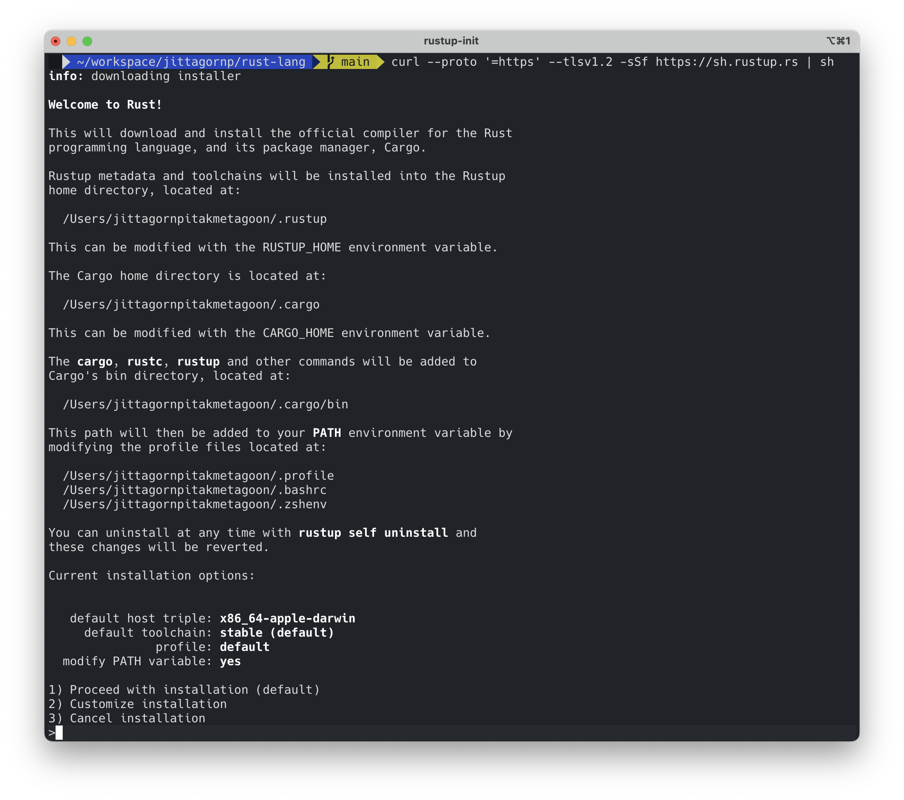
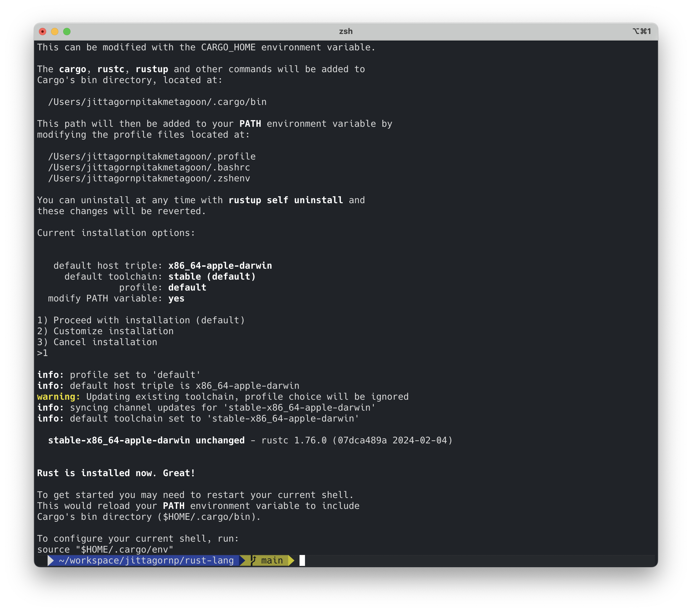
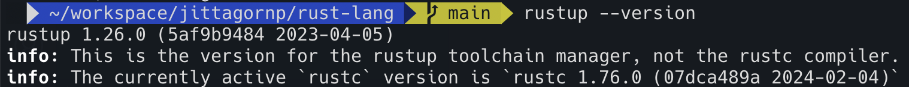
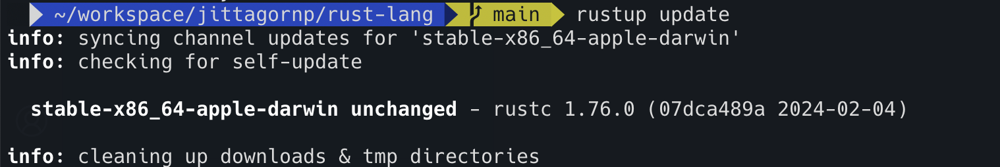

# Installation

> วิธีการติดตั้ง Rust

# Rustup 

1. Call command นี้ เพื่อ Install Rustup

```sh
curl --proto '=https' --tlsv1.2 -sSf https://sh.rustup.rs | sh
```



เลือก 1 แล้วกด Enter เพื่อ Install แบบ Default



2. Check Version

ลอง Run Command นี้เพื่อ Check Version ของ Rustup ดู

```sh
rustup --version
```



3. หากในเครื่องมีการ Install Rustup อยู่แล้ว และต้องการ Update Rustup ให้เป็น version ใหม่ล่าสุด ให้ Run command นี้

```sh
rustup update
```


