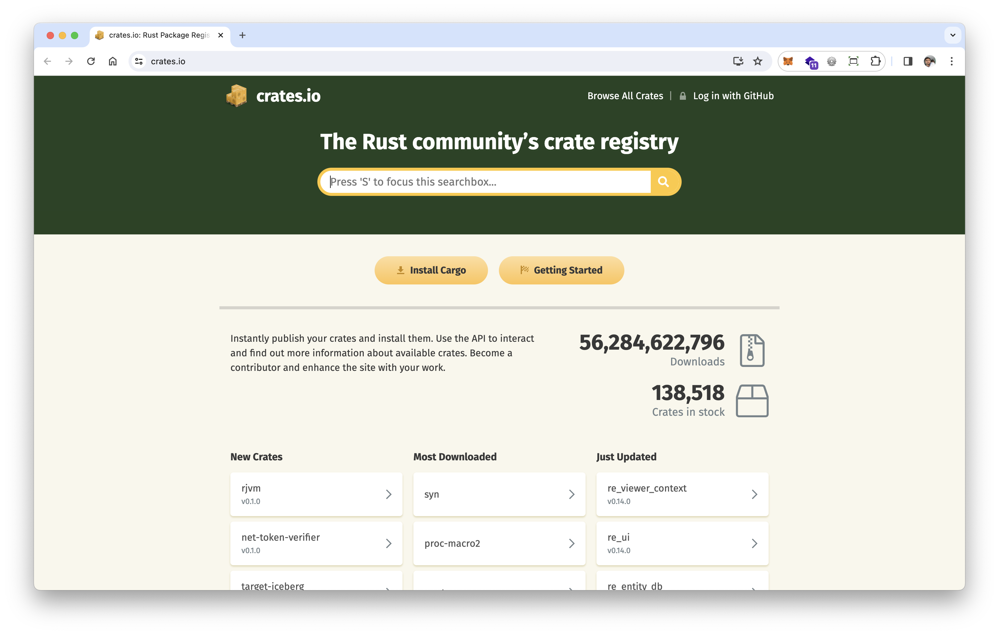
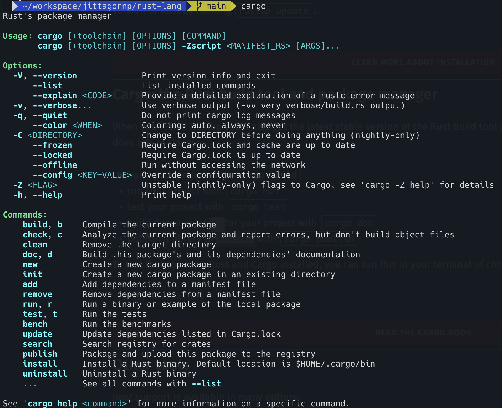

# Installation

> วิธีการติดตั้ง Rust

# Rustup 

1. Call command นี้ เพื่อ Install Rustup

```sh
curl --proto '=https' --tlsv1.2 -sSf https://sh.rustup.rs | sh
```


เลือก 1 แล้วกด Enter เพื่อ Install แบบ Default


2. Check Version

ลอง Run Command นี้เพื่อ Check Version ของ Rustup ดู

```sh
rustup --version
```


3. หากในเครื่องมีการ Install Rustup อยู่แล้ว และต้องการ Update Rustup ให้เป็น version ใหม่ล่าสุด ให้ Run command นี้

```sh
rustup update
```


เมื่อเราติดตั้ง Rustup ด้วยคำสั่งด้านบนเสร็จแล้ว จะมี Cargo แถมมาด้วย

# Cargo

> Cargo เป็น Build tool และ Package Manger ของ Rust จะคล้าย ๆ กับ NPM ของ Node หรือ Maven ของ Java

Check version

```sh
cargo --version
```


คำสั่งต่าง ๆ ของ Cargo

- `cargo new` สำหรับสร้าง Rust Project
- `cargo clean` สำหรับลบ/ล้าง Folder target
- `cargo build` สำหรับ Build/Compile Rust Project
- `cargo run` สำหรับ Run Rust Project
- `cargo test` สำหรับ Test Rust Project
- `cargo add` สำหรับ Add dependencies ต่าง ๆ เข้าไปใน Rust Project
- `cargo doc` สำหรับสร้าง Project Document 
- `cargo publish` สำหรับ Publish Library ไปไว้ที่เว็บ [crates.io](https://crates.io)



อื่น ๆ ดูเพิ่มเติมได้โดยการพิมคำสั่ง `cargo`

